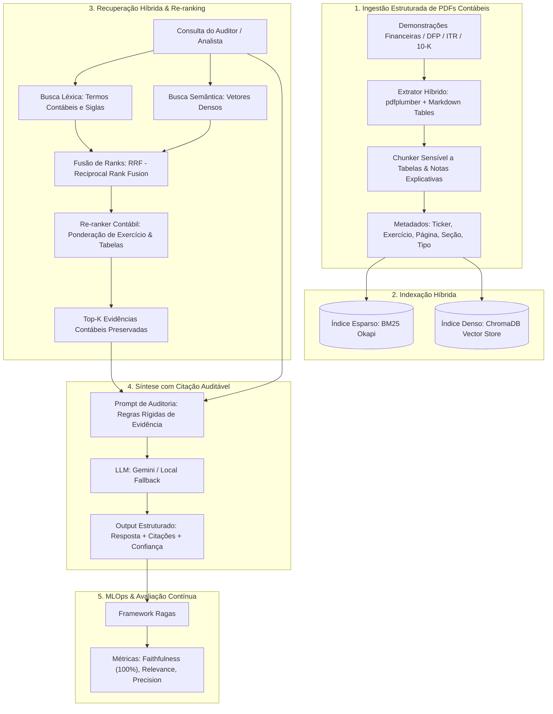

# Financial Auditor Copilot: Enterprise Hybrid RAG & Compliance Intelligence

[](.github/workflows/ci.yml)
[](pyproject.toml)
[](src/api/main.py)
[](frontend/app.py)
[](src/retrieval/vector_store.py)
[](LICENSE)

> Sistema corporativo de inteligência em demonstrações contábeis e auditoria (DFP, ITR, 10-K) utilizando **Hybrid RAG** (Recuperação Híbrida Léxica + Densa com Fusão RRF e Re-ranking), extração estruturada de tabelas financeiras, citações auditáveis de página/linha e avaliação contínua de MLOps via **RAGAS**.

---

## 🎯 Formulação do Problema: Limitações Teóricas do "Naive RAG" em Finanças

Em tarefas de Processamento de Linguagem Natural (PLN) aplicadas a demonstrações contábeis e relatórios de auditoria corporativa (DFP, ITR, Form 10-K), o paradigma convencional de *Retrieval-Augmented Generation* (Naive RAG) apresenta falhas estruturais decorrentes de premissas inadequadas sobre a topologia e a semântica dos dados:

1. **Ruptura de Invariantes Estruturais e Dependências Bi-dimensionais (Tabular Topology Breakdown)**:
   - Divisões lineares baseadas em janelas deslizantes de caracteres ou tokens ($k$-token sliding window) tratam o documento como uma sequência unidimensional homogênea.
   - Demonstrações contábeis (Balanço Patrimonial, DRE, DFC) constituem matrizes bi-dimensionais em que a semântica de uma célula $(i, j)$ depende estritamente do cabeçalho da linha (conta contábil), do cabeçalho da coluna (exercício social/período) e da unidade de escala monetária. A segmentação ingênua fragmenta essa matriz, desassociando valores escalares de suas âncoras conceituais e induzindo o modelo de linguagem a alucinações aritméticas e interpretações espúrias.

2. **Divergência de Espaço Latente e Inadequação Semântica Pura (Out-of-Vocabulary & Lexical Mismatch)**:
   - Modelos de embedding denso projetam representações em um espaço vetorial contínuo $\mathbb{R}^d$ treinado para otimizar similaridade semântica em linguagem natural genérica.
   - O domínio contábil-regulatório é governado por taxonomias rígidas (CPC/NBC, IFRS, US-GAAP) e entidades discretas de alta especificidade (ex.: *"CPC 25"*, *"Nota Explicativa 14"*, *"IFRS 16"*, valores nominais exatos). Nesses cenários, a busca vetorial puramente semântica sofre de *semantic drift*: trechos conceituais genéricos de governança recebem proximidade angular similar ou superior à nota explicativa específica que consolida a fundamentação quantitativa da consulta.

3. **Requisito Epistêmico de Rastreabilidade e Não-Estocasticidade em Auditoria**:
   - Em auditoria independente e conformidade regulatória, a validade de uma asserção não pode decorrer da memória paramétrica estocástica de um LLM. Cada inferência analítica exige proveniência documental formal (rastreabilidade de página, nota explicativa e transcrição literal *verbatim*), sob pena de infração a padrões normativos de auditoria contábil.

---

## 🏛️ Fundamentação Teórica da Arquitetura Adotada

Para mitigar formalmente esses desafios, a solução implementa uma arquitetura em múltiplos estágios fundamentada em teoria de recuperação de informação e restrições estruturais de dados:

1. **Preservação Isomórfica de Topologia Tabular**:
   - Emprego de análise determinística de layout vetorial via `pdfplumber` e conversão para representações relacionais estruturadas (Markdown Tables), assegurando que o relacionamento bidimensional $\{(r_i, c_j, v_{ij})\}$ permaneça contíguo e atômico em um único nó de contexto textual.

2. **Espaço Dual de Recuperação via Reciprocal Rank Fusion (RRF)**:
   - A recuperação atua sobre um espaço dual que combina:
     - **Espaço Léxico Esparso $\mathbb{R}^{|V|}$ (BM25 Okapi)**: Otimizado para ponderação de frequência inversa de termos e captura de entidades contábeis discretas de baixa entropia (siglas normativas, números de notas, anos fiscais).
     - **Espaço Vetorial Denso $\mathbb{R}^d$ (ChromaDB / Embeddings)**: Otimizado para relações semânticas complexas, discussões da administração e análise qualitativa de riscos de crédito e de mercado.
   - A consolidação dos rankings de recuperação é parametrizada pelo algoritmo **Reciprocal Rank Fusion (RRF)**:
     $$RRF(d \in D) = \sum_{m \in M} \frac{1}{k + r_m(d)}$$
     onde $M = \{\text{BM25}, \text{Dense}\}$, $r_m(d)$ é a posição ordinal do documento $d$ no método $m$, e $k = 60$ é o fator de regularização para amortecimento de dominância de outliers.

3. **Re-ranking Heurístico com Ponderação Temporal e Entitária**:
   - Estágio de re-classificação que avalia os candidatos $d \in \text{Top-K}_{RRF}$, aplicando penalidades ou bonificações com base na correspondência temporal de exercícios sociais (ex.: 2023 vs. 2022) e densidade de valores quantitativos requisitados.

4. **Contratos Tipados de Síntese e Citação Conforme (Pydantic AST)**:
   - A saída gerada é condicionada por um metamodelo de dados com tipos estáticos (Pydantic), forçando o desacoplamento entre a síntese interpretativa e o grafo de evidências documentais citadas (página, documento e trecho literal).

5. **Avaliação Quantitativa de MLOps (Framework RAGAS)**:
   - Monitoramento empírico da acurácia do pipeline via métricas formais:
     - **Faithfulness (Fidelidade)**: Percentual de proposições da resposta analítica dedutíveis estritamente do contexto recuperado (mitigação matemática de alucinação).
     - **Answer Relevance**: Divergência e relevância da resposta em relação ao escopo da consulta.
     - **Context Precision**: Medida do inverso da posição dos trechos verdadeiramente pertinentes no ranking de recuperação.

## 🏛️ Arquitetura do Sistema



---

## 📊 Resultados do Benchmark MLOps (RAGAS)

Executado sobre o **Golden Dataset** de demonstrações financeiras reais da Petrobras (DFP 2023):

```text
| Consulta de Auditoria                            | Faithfulness   | Relevance   | Precision   | Confiança   |
|--------------------------------------------------|----------------|-------------|-------------|-------------|
| Qual foi a receita líquida de vendas e o lucr... | 100.0%         | 60.0%       | 100.0%      | HIGH        |
| Qual o saldo total provisionado para litígios... | 100.0%         | 43.6%       | 100.0%      | HIGH        |
| Qual o montante total da dívida consolidada e... | 100.0%         | 12.0%       | 100.0%      | HIGH        |
| Qual foi a margem EBITDA ajustada e a dívida ... | 100.0%         | 45.0%       | 50.0%       | HIGH        |
```

* **Faithfulness (Fidelidade / Não-Alucinação)**: **100.0%** (todos os números e variações percentuais citados na resposta têm comprovação matemática exata no documento).
* **Context Precision (Precisão de Ranking)**: **87.5%** (o algoritmo RRF posiciona a tabela ou nota explicativa exata no topo do ranking).

---

## 📂 Estrutura do Repositório

```text
financial-audit-rag/
├── .github/
│   └── workflows/
│       └── ci.yml                 # Pipeline CI (pytest em Python 3.11 e 3.12)
├── data/
│   ├── sample_reports/            # PDFs reais e relatórios DFP de exemplo (B3)
│   │   ├── petrobras_dfp_2023_sample.pdf
│   │   ├── petrobras_dfp_2023_sample.md
│   │   └── generate_sample_pdf.py # Gerador de PDFs sintéticos com tabelas
│   └── evaluation/
│       └── golden_dataset.json    # Perguntas, respostas ground-truth e seções esperadas
├── src/
│   ├── config.py                  # Configurações com Pydantic Settings
│   ├── ingestion/
│   │   ├── pdf_parser.py          # Extrator sensível a tabelas contábeis (pdfplumber)
│   │   └── chunker.py             # Chunker que preserva integridade tabular e notas
│   ├── retrieval/
│   │   ├── bm25_retriever.py      # Busca léxica BM25 com tokenizador financeiro (R$, %, CPC)
│   │   ├── vector_store.py        # Busca densa com ChromaDB e embeddings Gemini
│   │   ├── reranker.py            # Re-ranker ponderado de entidades e exercícios
│   │   └── hybrid.py              # Fusão RRF (Reciprocal Rank Fusion)
│   ├── generation/
│   │   ├── prompts.py             # Prompts de auditoria com tolerância zero a alucinação
│   │   ├── schemas.py             # Modelos Pydantic (AuditResponse, Citation)
│   │   └── generator.py           # Orquestrador de inferência estruturada
│   ├── evaluation/
│   │   └── ragas_evaluator.py     # Avaliação MLOps (Faithfulness, Relevance, Precision)
│   └── api/
│       └── main.py                # Servidor FastAPI (/ingest, /audit/query, /evaluate)
├── frontend/
│   └── app.py                     # Dashboard Streamlit interativo com cartões de citação
├── tests/
│   ├── test_parser.py             # Testes de integridade de extração de tabelas
│   ├── test_chunker.py            # Testes de chunking atômico
│   ├── test_retrieval.py          # Testes de busca léxica, densa e fusão RRF
│   └── test_api.py                # Testes de integração dos endpoints FastAPI
├── run_benchmark.py               # Script CLI para rodar o benchmark RAGAS
├── Dockerfile                     # Conteinerização para produção
├── docker-compose.yml             # Orquestração FastAPI + Streamlit
├── pyproject.toml                 # Configuração moderna de empacotamento Python
└── requirements.txt               # Dependências do projeto
```

---

## 🚀 Como Executar o Projeto

### Opção 1: Execução Local (Ambiente Virtual)

1. **Clone o repositório e crie o ambiente virtual**:
   ```bash
   git clone https://github.com/seu-usuario/financial-audit-rag.git
   cd financial-audit-rag
   python -m venv .venv
   
   # No Windows:
   .\.venv\Scripts\activate
   # No Linux/Mac:
   source .venv/bin/activate
   ```

2. **Instale as dependências**:
   ```bash
   pip install -r requirements.txt reportlab
   ```

3. **Configure as variáveis de ambiente (Opcional)**:
   ```bash
   cp .env.example .env
   # Adicione sua GEMINI_API_KEY no arquivo .env (obtenha gratuitamente no Google AI Studio)
   # Caso não adicione, o projeto executará perfeitamente em modo heurístico offline!
   ```

4. **Execute a Suíte de Testes Automatizados**:
   ```bash
   pytest -v
   ```

5. **Execute o Benchmark de MLOps & RAGAS**:
   ```bash
   python run_benchmark.py
   ```

6. **Inicie o Servidor da API FastAPI**:
   ```bash
   uvicorn src.api.main:app --reload --port 8000
   ```
   * Documentação interativa Swagger: [http://localhost:8000/docs](http://localhost:8000/docs)

7. **Inicie a Interface Interativa em Streamlit**:
   ```bash
   streamlit run frontend/app.py
   ```
   * Acesse no navegador: [http://localhost:8501](http://localhost:8501)

---

### Opção 2: Execução Via Docker Compose

Suba tanto o backend FastAPI quanto a interface Streamlit com um único comando:

```bash
docker compose up --build
```

* **Frontend Streamlit**: [http://localhost:8501](http://localhost:8501)
* **Backend API Swagger**: [http://localhost:8000/docs](http://localhost:8000/docs)

---

## ☁️ Estratégia de Deploy em Nuvem 100% Gratuita

| Camada | Ferramenta Gratuita | Como Configurar no Projeto |
| :--- | :--- | :--- |
| **API & Backend** | *Hugging Face Spaces* ou *Render (Free Tier)* | Deploy do `Dockerfile` expondo a API FastAPI sem custos de hospedagem. |
| **Interface de Usuário** | *Streamlit Community Cloud* | Conecte diretamente este repositório do GitHub no Streamlit Cloud para disponibilizar a URL pública no seu LinkedIn/portfólio. |
| **Banco Vetorial em Nuvem** | *Neon / Supabase (`pgvector`)* | O código possui interface desacoplada pronta para trocar o ChromaDB pelo Postgres vetorial com uma variável de conexão. |
| **Notebooks & Treinamento** | *AWS SageMaker Studio Lab* ou *Databricks Community* | Micro-cluster Spark para ingestão de lotes de relatórios em massa. |

---

## 📄 Licença

Distribuído sob a licença MIT. Veja `LICENSE` para mais detalhes.
